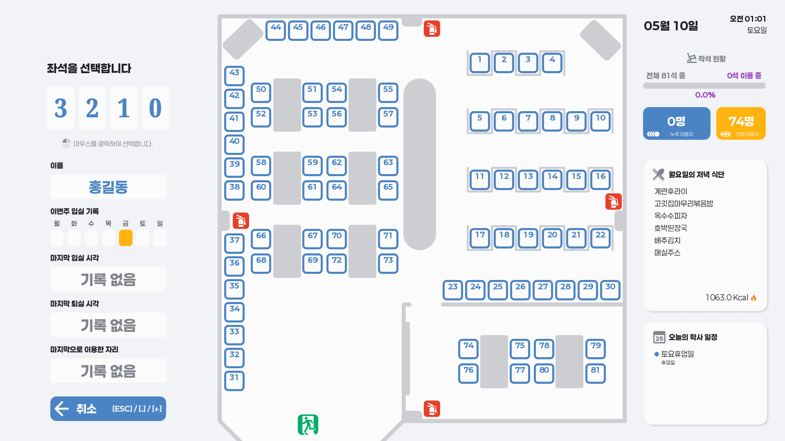
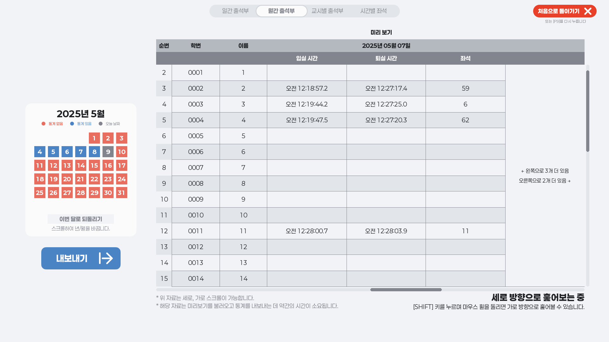
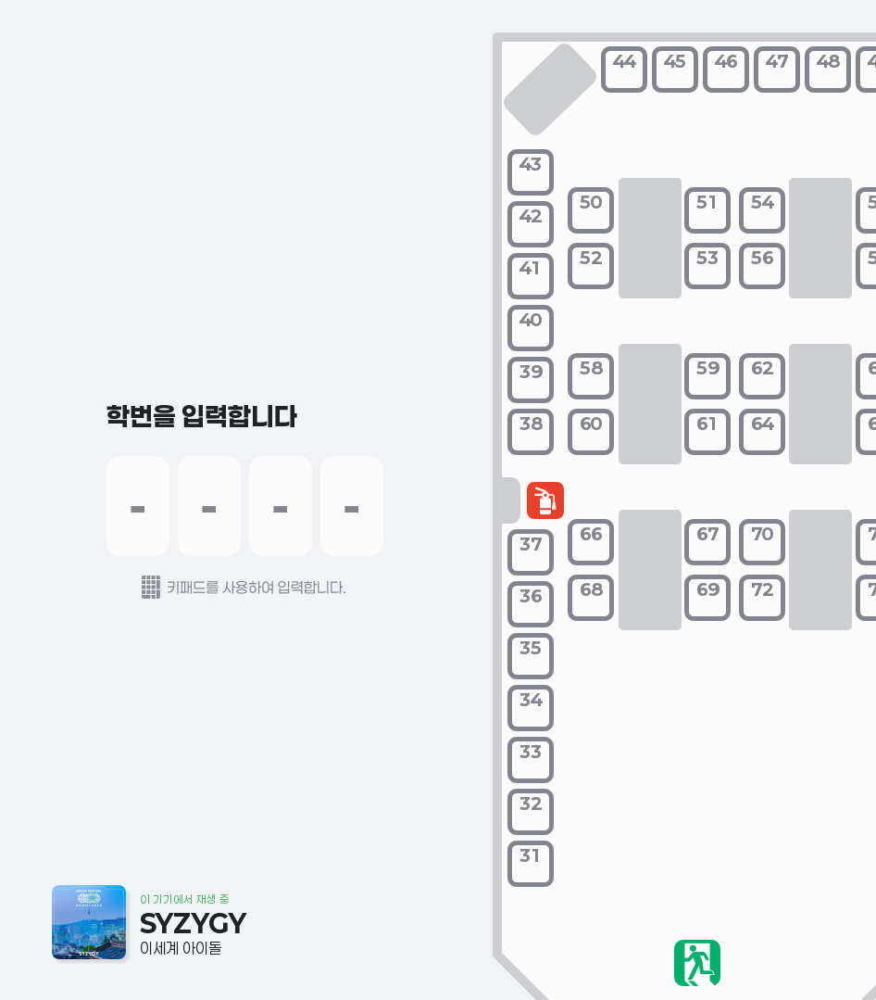
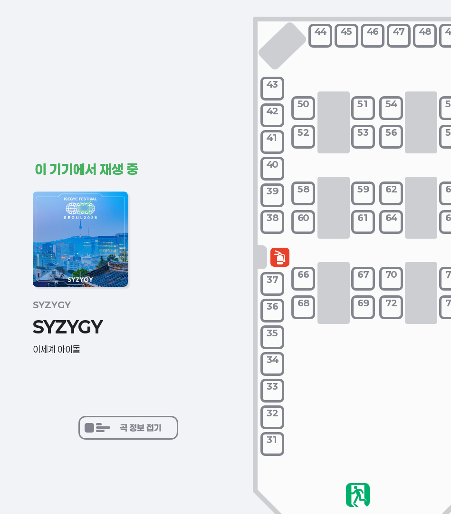
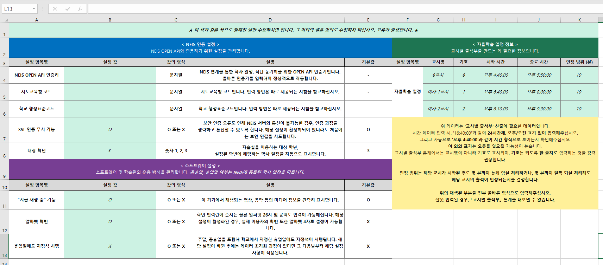

  

- - -

  'Chair' + '-y' = 'Chairy' [체어리]

 

>**📜📜 해당 프로그램은 주제심화탐구발표제 보고서를 목적으로 제작된 프로그램이며, 해당 리포지토리는 다른 친구들의 Python 공부를 위한 좋은 예제를 제공하기 위한 목적으로 생성/공개되었습니다.📜📜**

 

## 🪑 체어리가 뭔가요?

체어리는 학교 정독실의 입-퇴실 관리를 더욱 편리하고 체계적으로 관리하며, 용도에 맞게 다양한 통계를 내보냄으로써 정독실을 관리하시는 선생님들의 편의를 도모하기 위한 소프트웨어입니다.

고등학생이라면 누구나 배우는 Python의 기능들을 최대한으로 활용하여 Python의 잠재력을 최대한으로 발휘하는 한편, 실생활의 문제 해결에 프로그래밍을 적극적으로 활용하여 많은 사람들의 편의를 도모하였음이 해당 프로그램 개발과 주제심화탐구 활동의 의의입니다.

 

모든 기능은 **순수 Python**으로 구현하였으며, 최적화를 위해 **일부 Cython**을 이용하였습니다.

 

## ⚙️ 체어리가 제공하는 기능들

* ### 입/퇴실 관리 🪑

  

    
  

  * 학번을 입력하고 자리를 선택하여 입실 가능 ⌨️🖱️
  * 퇴실/자리 이동 시스템 🚪🪑

* ### NEIS와의 정보 연동 🌏

  * 석식 식단표 기능 🥄
  * 학년 맞춤 「오늘의 학사 일정」 기능 📆

* ### 통계 내보내기 기능 📜

  

    
  

  * 일간 출석부 조회/내보내기 🎫
  * 월간 출석부 조회/내보내기 📆
  * 교시별 출석부 조회/내보내기 🚥
  * 시간별 재실(在室) 현황 조회/내보내기 ⏰
  * 내보낸 통계는 Excel에서 확인 가능 📊

* ### 「이 기기에서 재생 중」 기능 🎺

  

    
    
  

  * 재생 중인 미디어를 간단히 표시 🎵🎞️
  * 썸네일, 앨범명, 트랙명, 아티스트까지 표시 가능 ✅
  * 썸네일을 눌러 더 크게 펼칠 수도 있음 ✅

* ### Excel을 이용한 간단한 설정 및 데이터 입력 📊

  

    
  

  * 소프트웨어 설정, 학생 정보는 물론, 좌석 배치까지 전부 엑셀로 수정 가능 ✅
  * 시간별 재실 현황이 기입되는 틀도 Excel로 제작, 수정, 확인 가능 ✅

* ### 이외에도 더 많은 유용한 기능들! 👏
  * 위에서 언급한 기능들 이외에도 소소하지만 유용한 기능들이 다양하게 들어있습니다!

 

## 🏫 라이선스 정보

  해당 레포지토리는 **GNU General Public License version 3.0 (GPLv3)** 라이선스가 적용됩니다. 
  따라서, 대략적으로 **다음 사항이 적용**됩니다.

>  
>
> ✅ **복제, 배포, 수정 및 재배포** 가능   
> ✅ **상업적 활용** 가능  
> ⚠️ 수정 및 재배포시 **소스코드 공개 의무**  
> 🚫 **라이선스 변경 불가**   
>

 

## 📕 활용한 라이브러리들

  - pygame
  - openpyxl
  - requests
  - winrt-Windows.media
  - winrt-Windows.media.control
  - winrt-Windows.foundation
  - winrt-Windows.foundation.collections
  - winrt-Windows.storage
  - winrt-Windows.storage.streams

   

- - -

@RamelLatte